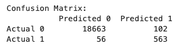
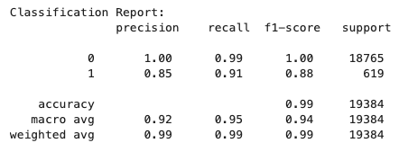

# Credit Risk Classification
Open ***credit_risk_classification.ipynb*** and run all cells to access the following results and analysis:

## Overview
##### **Purpose**
The purpose of this model is to optimize the decision-making process within lending activities by accurately assessing the creditworthiness of borrowers. Using a model like this to predict the likelihood of a borrower defaulting on a loan, allows the lender to make an informed and financially responsible business decision when deciding whether or not to take on a loan and back the borrower. 

##### **Variable Predictions** 
* Target Variable: `loan_status`
`loan_status` is assigned either a `0` or `1` depending on the borrowers assumed risk (pre-assigned)
    * `0` (Healthy Loan): Low risk of loan default
    * `1` (High-Risk Loan): High risk of loan default

##### **Methods Used** 
from `sklearn.model_selection` import `train_test_split`
from `sklearn.linear_model` import `LogisticRegression`
from `sklearn.linear_metrics` import `confusion_matrix`, `classification_report`

##### **Machine Learning Process**
1. Create `lending_data_df` by loading in the data from `lending_data.csv` (found in the Resources folder) 

2. Assign `y` to the target variable `loan_status` (what we are trying to predict)  

3. Create `X` DataFrame using `lending_data_df.drop` to include all columns with the exclusion of `loan_status`  

4. Split the data into training and testing datasets by using `train_test_split`

    * `X_train` 
        * Includes all input variables except our target variable, used to fit model during training

    * `X_test` 
        * Independent variables of data not used in training, reserved for testing and making predictions with our trained model

    * `y_train`
        * Contains only our target variable and is used alongside `X_train`, training our model to learn the relationship between features and the target

    * `y_test` 
        * Contains our actual target values and is used to evaluate our model's performance by comparing against our predictions

5. Create `LogisticRegression` model
    * Assign a `random_state` parameter of 1
    * Fit model with training data

6. Using the trained logistic regression model, `.predict` to make a prediction with the testing data `X_test`

    * Store in a new variable `y_predict`

7. Evaluate our model's performance for accurately predicting an actual `0` or `1` by comparing what actually happened `y_test` against our model's prediction

    * Create a `confusion_matrix` to return a count of predicted values compared to the true values 
    
        *  Array returns results to be further classified as either: **`TP`**, **`TN`**, **`FP`**, **`FN`**

    * Create a `classification_report` for detailed insight on performance metrics of the model 
    
        *  Further analyze the model's performance by comparing the individual precision, recall and F1-score of our two classes `0` and `1`
        * Visualize the model's overall accuracy and weak points where incorrect predictions may have been made by the model
        

8. Analyze the predictions made by our linear regression model

-----------
## Results

* **`563` True Positives (TP)** 
    * *High-risk loans correctly predicted as high-risk*
    * Actual = `1`  →  Predicted = `1`
* **`18,663` True Negatives (TN)**  
    * *Healthy loans correctly predicted as healthy*
    * Actual = `0`  →  Predicted = `0`
* **`102` False Positives (FP)**
    * *Healthy loans incorrectly predicted as high-risk*
    * Actual = `0`  →  Predicted = `1`
* **`56` False Negatives (FN)**
    * *High-risk loans incorrectly predicted as healthy*
    * Actual = `1`  →  Predicted = `0`

#### **Model Prediction for `0` (Healthy Loans):** 
* **Precision: `1.00`**
    * The precision score for healthy loans is 1.00, as precise as possible, meaning that of the loans predicted healthy, 100% were correctly identified as healthy.
* **Recall: `0.99`**
    * The recall for healthy loans is also very high, with 99% of all actual healthy loans found in the data being correctly predicted by the model.
* **F1-score: `1.00`**
    *  An F1-score of 1.00 indicates a 'perfect model,' where every prediction made was correctly (perfect precision and recall). This means that the model correctly identifies all actual healthy loans without error (100%).
 
#### **Model Prediction for `1` (High-Risk Loans):**  
* **Precision: `0.85`**
    * The precision score for high-risk loans is 0.85, meaning that of the high-risk loans predicted by the model, only 85% were actually high-risk loans.
* **Recall: `0.91`**
    * The recall for high-risk loans is 91%, meaning that of all actual high-risk loans found in the data, 91% were correctly predicted by the model.
* **F1-score: `0.88`**
    *  The model returned an F1-score of 0.88, giving it an average of 88% precision and recall when identifying high-risk loans.

#### **Overall Model Performance**
* **Accuracy: `0.99`**
    * This indicates that 99% of all predictions were correctly identified as either healthy or high-risk loans.
* **Macro Average:** Represents the overall performance (*on average*) of the model when predicting either healthy or high-risk loans
    * **Precision: `0.92`**
    *  **Recall: `0.95`**
    *  **F1-score: `0.94`**
* **Weighted Average:** Represents an average of the model's performance, giving more weight to the class with the majority of instances (healthy loans in this case)
    * **Precision: `0.99`**
    *  **Recall: `0.99`**
    *  **F1-score: `0.99`**
-----------
## Summary Analysis
Based on the results provided by both the confusion matrix model and classification report, our logistic regression model seems to be performing exceptionally well when accurately predicting healthy loans `0`, with perfect `1.00` precision and *near* perfect recall ( **99%**). It is noted that comparatively our model does not seem to be performing nearly as well when predicting actual high-risk loans `1`, presenting with a slightly lower precision (`0.85`) and recall (`0.91`). 

Overall and individual F1-scores for this model are all considered to be of acceptable harmonic mean (`1.00`, `0.88`, `0.94`, `0.99`), demonstrating the model's balance of recall and precision when returning predictions. Furthermore, the model did not seem to have any difficulty detecting a true negative ( **100%**), although it did seem to detect true positives at a lower rate of precision ( **85%**). 

Overall, this model demonstrates a very high accuracy ( **99%**) with exceptional performance, particularly in accurately predicting healthy loans `0`. While there is still a good balance between precision and recall for high-risk loans `1`, there is definitely room for improvement in precision.

### Resources
#### Documentation
* [Confusion Matrix: scikit-learn Documentation](https://scikit-learn.org/stable/modules/generated/sklearn.metrics.confusion_matrix.html)
* [F1-Score: scikit-learn Documentation](https://scikit-learn.org/stable/modules/generated/sklearn.metrics.f1_score.html)
* [Classification Report: scikit-learn Documentation](https://scikit-learn.org/stable/modules/generated/sklearn.metrics.classification_report.html)

#### Additional Resources
* [Understanding Individual Uses of X_test, X_train, y_test, y_train](https://stackoverflow.com/questions/60636444/what-is-the-difference-between-x-test-x-train-y-test-y-train-in-sklearn)
* [Precision, Recall, and F1-Score](https://towardsdatascience.com/a-look-at-precision-recall-and-f1-score-36b5fd0dd3ec)
* [F1-Score in Machine Learning](https://www.geeksforgeeks.org/f1-score-in-machine-learning/)

